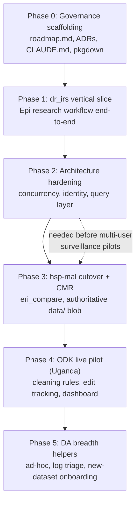

# erifunctions V2: Development Phases Roadmap

> **Status:** living document. This is the shared, version-controlled north star for V2.
> Update it as phases land or decisions change, and record any architectural decision as an
> ADR under [`docs/adr/`](adr/). See [`CLAUDE.md`](../CLAUDE.md) for the working conventions
> that keep development aligned with this roadmap, and [`vision.md`](vision.md) for the
> founding brief this plan derives from.
>
> **Where we are (2026-06-30):** Phases 0–2 complete. **Phase 3 cutover/simulation tooling is
> complete and offline-tested, the next step is a real-data *pilot* (parallel run), not more
> building**; the actual cutover and legacy-adapter retirement wait on real CMR/malaria uploads.
> Phase 4 (ODK live pilot + the "Mimic" dashboard) is the next build, pending a direction call.

## Context

`erifunctions` is the Carter Center ERI team's R package: the API through which Data
Analysts (DAs) and Epidemiologists (Epis) interact with TCC's Azure-centred data system
across countries (Haiti, DR, Uganda, OEPA) and diseases. V1 was built fast and organically
through **seven phases (v0.2.0 → v0.8.0)** and already ships most of the founding vision: the
3-layer data model + approval gate (`R/dal.R`), DQ engine (`R/dq.R`), CMR/surveillance
ingest, ODK lifecycle, data catalog, research scaffolding (`R/research.R`),
spatial/epi/reporting, SharePoint/Teams, and onboarding.

So **V2 is not a greenfield refactor.** It is: (1) resolve the architecture decisions V1
deferred, (2) harden V1 for real non-developer users, (3) fill the functional gaps the
vision implies, and (4) keep design intent under version control so it survives across
sessions and teammates.

**All three pilots (`dr_irs`, CMR/surveillance, and ODK) are first-class V2 work.**
`dr_irs` leads simply because its data is already available; the real CMR and ODK uploads
are ~a week out. Critically, the CMR/surveillance and ODK phases are **not blocked on those
uploads**: they can be developed against the data already in Azure (`staged/`, `raw/`) as a
**simulation harness**, with real-data validation following when the uploads land. Caveat:
much of the staged Excel is *already clean*, so to exercise the DQ and cleaning-rule paths
the harness must **synthesize realistic anomalies** into a copy of that clean data rather
than assume dirty input.

The ordering puts the chosen first pilot (`dr_irs`, single-analyst, low-stakes, exercises
the most novel research machinery) ahead of the multi-user surveillance pilots, and inserts
architecture hardening (concurrency/identity) *before* concurrent surveillance approval
becomes load-bearing.

---

## Architecture decisions

Each decision below is captured as a standalone ADR. They are the substance of the founding
brief's "Some Questions" section (see [`vision.md`](vision.md)).

| ADR | Decision | Resolves |
|-----|----------|----------|
| [0001](adr/0001-single-package-with-pkgdown.md) | Stay a single package; solve discoverability with pkgdown grouped reference + role vignettes | "Split into eriauth/eriresearch/…?" |
| [0002](adr/0002-concurrency-safe-metadata.md) | Make catalog/registry writes concurrency-safe (ETag/optimistic) and rebuildable | "Do we need a formal database?" |
| [0003](adr/0003-token-derived-identity.md) | Derive approver identity from the auth token, not a self-declared env var | Approval-gate integrity |
| [0004](adr/0004-duckdb-query-layer.md) | Keep blob as system-of-record; add a serverless DuckDB query layer | "Better use of Azure storage?" |
| [0005](adr/0005-pull-then-process.md) | Confirm pull-then-process; provenance via the pull entry points | "Pull-then-process vs push?" |
| [0006](adr/0006-research-projects-as-repos.md) | Research projects are separate repos generated from a template, depending on erifunctions | "How to organise Epi analysis code?" |
| [0007](adr/0007-research-aware-spatial-sourcing.md) | Research-aware spatial sourcing: a `cache` flag on `eri_spatial_load()` delegating to `eri_research_pull()` | Reproducible spatial inputs (Phase 1) |
| [0008](adr/0008-baked-azure-auth-defaults.md) | Bake non-secret auth constants into the package; default to interactive AAD auth | Zero-config login (Phase 2 precondition, brought forward) |
| [0009](adr/0009-research-data-lifecycle.md) | Azure is the source, the research project the versioned working copy; pulls archive + dedup, canonical writes gated | Reproducible research inputs (Phase 1) |
| [0010](adr/0010-odk-repeat-group-tables.md) | ODK repeat groups land as a relational set of tables (one Parquet per export table), approved together | ODK repeat-form fidelity (Phase 4) |
| [0012](adr/0012-source-measure-data-model.md) | Address data by 5 axes splitting data_source (channel) from data_type (measure); general ingest core + legacy adapters | Coherent data-addressing model (#175); supersedes ADR-0011 |
| [0013](adr/0013-odk-submission-backfill.md) | Write records *into* ODK Central (submission backfill): deterministic instanceID idempotency, columns map by field name, repeats reuse ADR-0010 | `eri_odk_upload()` (Phase 4, #211) |
| [0014](adr/0014-feedback-ticket-log.md) | In-package feedback / ticket log in the `data/` blob (capture now via `eri_feedback()`, reusing ADR-0002/0003); triage is a later feature | Tight adoption feedback loop (#237) |
| [0015](adr/0015-hsp-mal-cutover-criteria.md) | hsp-mal cutover gate: per-stream value/row parity (`strict_schema = FALSE`) for N=3 consecutive periods, recorded in a cutover ledger; human-triggered | Objective Phase-3 cutover criteria (#245) |
| [0016](adr/0016-metadata-conditional-writes-blob-endpoint.md) | Conditional metadata writes (ETag optimistic concurrency) go through the blob endpoint, not the Data Lake Gen2 endpoint | ADR-0002 concurrency implementation detail |
| [0017](adr/0017-cmr-staged-file-supersession.md) | Superseding staged CMR files: opt-in delete, anchored match; detect-and-report by default | CMR re-run hygiene (DQ workflow redesign, phase 2) |
| [0018](adr/0018-dq-schema-local-overrides.md) | DQ schema local overrides: three-tier resolution (local → Azure → bundled), hash-based expiry, never-silent envelope markers | DQ schema override lifecycle (DQ workflow redesign, phase 3) |

---

## Phase 0: Governance & shared memory scaffolding  *(landed)*

Moves design intent out of the gitignored `sandbox/` and into the repo so teammates and
fresh sessions inherit it.

- **`docs/roadmap.md`**: this document.
- **`docs/adr/`**: the six ADRs above plus a README explaining the format.
- **`CLAUDE.md`** (repo root), concise project memory: purpose, the 3-layer model +
  approval gate, naming conventions, where ADRs/roadmap live, the "global vs local solution"
  guardrail, and the pre-PR check routine.
- **`_pkgdown.yml`**: grouped function reference (ADR-0001) + articles from existing vignettes.
- **`.github/workflows/pkgdown.yaml`**: build/deploy the documentation site.
- README version banner fix + roadmap link.

**Verification:** `R CMD check` clean; `pkgdown::build_site()` renders with the grouped
reference; ADRs and roadmap render; links resolve. (Built in CI; this repo's dev container
has no local R.)

---

## Phase 1: `dr_irs` vertical slice (Epi research, end-to-end)  *(first pilot)*

Drive the real DR IRS interrupted-time-series study end-to-end with the package. **The
package's role here is to *source data reproducibly* and *maintain study-data discipline*,
not to do the analysis.** Epidemiologists run the ITS themselves (matching, windowing,
modelling, counterfactuals) in the research repo (ADR-0006); the package removes the friction
around getting data in, keeping it reproducible, and producing standard figures. The
scaffolding already fits, `eri_research_init("dr_irs_2024", "dr", "malaria", …)` is the
documented example.

**Required input:** `dr_irs.R` and the structure of its IRS / incidence / spatial inputs
(local, gitignored).

1. **Source the data with provenance.** IRS is not routinely reported, so digitized IRS data
   enters via `eri_artifact_upload()` → `eri_artifact_pull()`; malaria incidence comes from
   the surveillance `processed/` layer via `eri_research_pull()`; spatial (admin boundaries,
   LandScan) is sourced from the Azure `spatial/` blob via `eri_spatial_load()` /
   `eri_spatial_pop()`. **Gap:** spatial reads from Azure without caching. Cache every input
   into the project and record it in `research.yaml` for reproducibility. Exercise the
   surveillance pipeline (`eri_ingest` → `eri_stage` → `eri_approve`) by updating incidence
   with a newer country dataset, then re-pulling.
2. **Reconcile inputs for sourcing** (not analysis): a thin, opt-in geocoding/admin-unit
   reconciliation helper mapping free-text localities to canonical admin units
   (`eri_spatial_join`). The ITS matching/windowing/modelling stays in the research repo.
3. **Version-tag-linked-to-publication** (genuine gap): `eri_research_snapshot()` freezes
   `data/` but gives no named tag binding *data + code commit + outputs* to a publication.
   Add `eri_research_tag(label, …)` recording snapshot ref + analysis git SHA + output
   manifest, so an analysis is reproducible from a citation, including across data updates.
4. **Research-repo template** (ADR-0006): port `dr_irs` into a standalone repo from the new
   template as the reference example (this is where the ITS analysis lives).
5. **(Stretch) figures:** thin helpers on top of `eri_map_*` / `eri_brand_ggplot_theme()` for
   the recurring study figures.
6. **Epidemiologist documentation** *(done)*: a role-oriented, copy-paste **worked example** of the
   full research lifecycle on safe public data (`vignettes/epi-research-guide.Rmd`, using
   `mtcars`), superseding the older `research-workflow` vignette. This also seeds the **task-guide
   framework** (one guide per user role × task), tracked in [`guides.md`](guides.md), the live
   index of which guides exist and which are still missing.

**Verification:** a `test-smoke.R`-style live test (`ERI_SMOKE_TESTS=true`): init → pull IRS
artifact + incidence + spatial (cached, with provenance) → [analysis runs in the example
research repo] → upload outputs → `eri_research_tag()`; update incidence through the pipeline
and re-tag; re-pull the original tag on a clean checkout and reproduce its figure.

---

## Phase 2: Architecture hardening

Implements ADR-0002/0003/0004 before multi-user surveillance pilots make concurrency and
identity load-bearing.

> **Update (2026-06-16):** the *interactive-auth enablement* half of ADR-0003 landed early,
> zero-config browser auth via baked non-secret defaults ([ADR-0008](adr/0008-baked-azure-auth-defaults.md)),
> because epidemiologists couldn't use the package without it. Token-derived approver identity
> (`.eri_token_identity()`, below) remains the Phase 2 work.
- ~~Concurrency-safe + rebuildable catalog/registries (`R/catalog.R`, `R/odk_registry.R`,
  `R/artifacts.R`); add `eri_catalog_rebuild()`.~~ **Shipped**: catalog/registry/artifact writes go
  through `.eri_yaml_update()` (read-with-ETag, conditional `If-Match`/`If-None-Match` write, re-read +
  retry on 412); `eri_catalog_rebuild()` reconstructs the catalog from the processed-layer parquet
  listing (ADR-0002). **Closes Phase 2.**
- ~~`.eri_token_identity()`; `eri_approve()` uses verified identity.~~ **Shipped**: governed actions
  (approve `approved_by`, catalog `registered_by`, op-logs) record the verified Azure AD token identity;
  `ERI_ANALYST_ID` is the service-principal fallback (ADR-0003).
- ~~`eri_query()` DuckDB-over-parquet read layer.~~ **Shipped**: catalog-driven roll-ups + explicit-table
  joins over processed parquet via an in-process DuckDB session (`duckdb`/`DBI` as Suggests). Brought
  forward to close the DA ad-hoc-request task ahead of the rest of Phase 2 (concurrency-safe metadata
  and token identity), which has since shipped.

**Verification:** concurrent-writer unit test shows no lost updates; a spoofed
`ERI_ANALYST_ID` no longer changes `approved_by`; `eri_query()` SQL across two processed
datasets returns a correct join.

---

## Phase 3: hsp-mal cutover tooling + CMR/surveillance pilot

Make the `data/` blob authoritative and retire the contractor pipeline on evidence. Built
against existing Azure data as a simulation; validated against real uploads when they land.

> **Status (2026-06-30): the cutover *tooling* is COMPLETE. The next step is a real-data
> pilot, not more building.** Everything below the line is shipped and offline-tested; what
> remains (the parallel run, the equivalence streak, the adapter retirement) is operational
> work that needs real CMR/malaria uploads and a maintainer at the trigger.

- ~~**`eri_compare()`**: diff `eri_ingest()`'s `data/staged` output against the
  `projects/intermediate` (hsp-mal) output.~~ **Shipped** (#244): keyed row+value reconciliation,
  schema diff, numeric/NA-aware, `strict_schema` flag; returns an `eri_comparison` object.
- ~~Define written **cutover criteria** (N consecutive periods of equivalence) as an ADR.~~ **Done**
  ([ADR-0015](adr/0015-hsp-mal-cutover-criteria.md), #246): per-stream value/row parity
  (`strict_schema = FALSE`) for N=3 consecutive periods, recorded in a cutover ledger, human-triggered.
  Pins the `equivalent` semantics so policy and `eri_compare()` can't drift.
- ~~**Cutover ledger**: record each period's comparison + compute the streak.~~ **Shipped** (#250):
  `eri_cutover_check()` records a period (the cutover-standard comparison) and `eri_cutover_status()`
  reports the streak vs N and eligibility, ordered by the data period.
- ~~**Simulation harness**: anomaly-injection so the DQ and reconciliation paths are genuinely
  exercised against otherwise-clean data.~~ **Shipped**: `eri_inject_anomalies()` (#248) dirties clean
  data reproducibly; `eri_simulate_check()` (#254) injects + reconciles in one call to confirm the gate
  catches a divergence.
- ~~Harden `eri_ingest_cmr()` / `eri_stage()`; fold DQ failures into the log-triage surface.~~ **Done**:
  CMR period/sheet hardening (#252); the DQ→triage fold was already in place (`eri_ingest()` persists
  flags via `eri_dq_log()` into the `eri_logs()` backlog), and stage/ingest already have full op-log +
  tryCatch capture.
- **Training/testing sandbox for the CMR pipeline** — shipped a synthetic `atlantis` CMR schema
  (`inst/schemas/cmr/atlantis.yaml`) so the full `eri_split_cmr → eri_approve → eri_read` flow runs
  end-to-end without writing into a real country's namespace. Deliberately **narrow** (CMR-only) for
  now; a general first-class "registered sandbox" namespace usable across pipelines (ODK, general
  ingest, research) is a candidate for a future ADR rather than one fake schema per pipeline.
- **Retire the legacy adapters** that [ADR-0012](adr/0012-source-measure-data-model.md) isolates: the
  `projects`-blob dual-write (`mirror_pipeline`), `.eri_pipeline_registry`, `.eri_schema_country_map`,
  and the `rblf` combined code. **Deferred to the cutover itself** (irreversible; only once a stream's
  streak is met and a maintainer triggers it).

**Pilot (the next operational step):** run `eri_ingest(..., mirror_pipeline = "hsp-mal")` on the real
periods as they arrive; `eri_cutover_check()` each one; watch `eri_cutover_status()` reach the N-period
streak; only then retire the adapters for that stream. The toolchain is ready and end-to-end tested
offline. It needs real uploads, not more code.

**DQ workflow redesign (shipped, pilot-feedback-driven):** the SDN/SSD CMR pilot surfaced a
recurring pain point — a DA fixing DQ flags had no structured way to note *what* they fixed or *why*,
and no way to trace a `processed/` figure back to the exact source bytes it came from. A design consult
scoped an 8-phase plan to close this: (1) raw retention + source hashing on every ingest path — **shipped**
(this doc's entry, NEWS 0.9.11); (2) CMR re-run hygiene (staged-file supersession, DQ-log supersession,
`excel_row` provenance) — **shipped and validated**: these three landmine fixes actually landed in
PR #272 the same week, *before* the design consult was even commissioned (`supersede_staged` /
ADR-0017, `eri_cmr_dq_report(supersede = TRUE)`, `excel_row` in `eri_ingest_cmr()`); the consult's own
review confirmed nothing else was missing, and a live end-to-end run against the `atlantis` sandbox
(2026-07-10: split → flag an invalid district → fix → re-split with `supersede_staged` → re-report →
`eri_approve_cmr()`) confirmed exactly one file set gets promoted, with all test artifacts cleaned up
afterward; (3) DQ schema override lifecycle — **shipped** ([ADR-0018](adr/0018-dq-schema-local-overrides.md)):
three-tier resolution (local override → Azure → bundled) inside `load_dq_schema()`,
`eri_dq_schema_path/edit/status/reset()`, sidecar metadata, hash-based retire-on-upstream-change (an
override is retired, never kept forever or silently discarded, once the Azure/bundled copy it forked
from changes), `schema_source`+`schema_hash` carried from the schema through `run_dq_checks()` into
every `dq_flags` log entry; (4) `eri_feedback()` context/attachment + `eri_dq_schema_submit()` —
**shipped**: `eri_feedback()` gained optional `context` (a named list, e.g. dataset axes) and
`attachment` (a local file uploaded to `_feedback/attachments/{token}/`, *before* the log append so a
failed upload never leaves a dangling reference) params, both backward-compatible (`NULL` default,
legacy-shaped tickets read fine); `eri_dq_schema_submit()` packages a live local schema override into
a `dq`-area ticket with an auto-drafted human-readable diff against the schema it forked from (typed
alias/allowed-values edits shown as set diffs, everything else as before → after), the full override
file attached, and the four ADR-0012 axes as `context` — a maintainer folds it in by updating the
Azure `schemas/` blob directly (`load_dq_schema()` already prefers it), not by cutting a release; (5)
`eri_audit()` — **shipped**, as an event-level operation timeline (this note originally described it
as walking a value's byte-level lineage `processed → staged → raw`; the actual Q5 design settled on
reconstructing the sequence of *operations*, not literally re-deriving lineage from raw bytes — the
gap is closed by also carrying `source_hash`, below, rather than by a separate lineage walker): a new
`R/audit.R` explodes every log entry across the given axes into one row per event (a file staged, a
workbook split with its routing plan, a DQ check run, each individual flag resolved, a whole log
entry closed out, an approval — cashing in `eri_approve_cmr()`'s `dq_reviewed` cross-reference), each
row also carrying the entry's `source_hash` when one was recorded (Phase 1) so a power user CAN trace
which exact bytes backed a step, not only which operation ran; returned as a single chronological
(oldest-first) tibble with its own `cli`-rendered print method; no CMR-specific entry point needed
(leaving the axes unscoped already enumerates the `rblf/cmr` split/approve coordinate alongside
every fanned-out measure — validated live against a real atlantis split → dq → approve trail);
(6) `eri_approve_cmr()` force-approve path — **shipped**: `force = TRUE` requires a non-empty
`justification` (no interactive confirmation gate here — that's Phase 7's job, since this scriptable
core has to work unattended in scripts/CI), approves despite an outstanding measure, annotates each
bypassed `dq_flags` entry `handled` via `eri_logs_resolve(..., forced = TRUE)` (never silently
resolved, never left rotting the open backlog forever) with a note pointing back at the approval's
own log, and records `forced`/`justification`/`bypassed` on that log; `eri_audit()` renders both the
forced approval and the bypass annotation in red with a `[FORCED]` prefix rather than folding them in
as ordinary events — sequenced deliberately after Phase 5 so the override is born fully auditable,
never before. Live-validated against a real atlantis force-approval end-to-end; (7)
`eri_dq_review()`, an interactive wrapper over the existing scriptable core — **shipped**: pure
orchestration in new `R/dq_review.R` (no new mutations of its own) over `eri_cmr_dq_report()`,
`eri_dq_flag_resolve()`/`eri_logs_resolve()`, `eri_dq_schema_edit()`/`eri_dq_schema_submit()`,
`eri_split_cmr()`, and `eri_approve_cmr()` (including its force path, with a typed
period-confirmation gate this interactive layer adds on top of the scriptable core's mandatory
justification); refuses to run non-interactively (`rlang::is_interactive()`); `rstudioapi` added
to `Suggests` only, guarded behind `.eri_open_file()`. A semi-live validation run (real Azure core
calls, only the prompt helpers scripted) caught a real design bug before it shipped: the loop
originally re-ran the DQ check at the top of every iteration, so marking a flag not-important
(which doesn't touch the underlying data) would get re-flagged as a brand-new "open" issue
forever — fixed by tracking the flags tibble in-memory between loop iterations and only
re-fetching on an explicit "Re-run" action; (8) `eri_dq_export()` + guide convergence — **shipped**:
new `R/dq_export.R` renders a DQ flags tibble to a self-contained HTML (with a print stylesheet, so
browser print-to-PDF works cleanly, avoiding a pagedown/weasyprint dependency) or Markdown file,
organised by `sheet` when present; deliberately generalised beyond the CMR case to also accept a
plain `run_dq_checks()` flags tibble (`column`/`value`/`issue` only — no `sheet`/`excel_row`/`status`),
rendering one flat table instead of per-sheet sections; shares its page shell/CSS/table helpers with
`eri_feedback_report()` via a new `R/reports_lite.R` (both are hand-rolled rather than routed through
`eri_report_html()`, which hard-requires Quarto); wired into `eri_dq_review()`'s "Print report" menu
item, which now hands it the in-session flags tibble (including any `status`/`note` triage from that
session) instead of only printing to console. Closes the loop the whole redesign started from: a DA's
DQ triage now produces a structured, attributable handback artifact instead of an ad hoc table. All 8
phases of the DQ workflow redesign are now shipped.

**Docs site & guidance system redesign (in progress):** the DQ workflow redesign's biggest lesson —
collapsing "remember N functions in the right order" into "answer a guided menu" — prompted a second
Fable design consult on the pkgdown documentation site itself, asking whether the same idea
generalizes beyond DQ to the whole package. The consult proposed an 8-phase plan: (1) reference
architecture — **shipped**: `_pkgdown.yml`'s reference index consolidated from 17 module-shaped
groups (which mirrored `R/` source files — "Data pipeline" vs. "Data quality" vs. "Logs & triage" all
described one lifecycle a user experiences as a single loop) to 15 lifecycle-shaped groups, functions
within each ordered by what to reach for first rather than alphabetically; a new "Start here" group
surfaces `eri_data_model()`, `eri_data_path()`, `eri_dq_review()`, and `eri_verbosity()` regardless of
which lifecycle group they'd otherwise sit in (`eri_data_path()`/`eri_dq_review()` also cross-listed
in their original lifecycle groups); degenerate/overlapping groups merged ("Data catalog" +
"Querying", "SharePoint & Teams" + "Feedback"); a docs-only, single-file change, verified lossless
(152 unique reference topics before and after, only the two intentional cross-listings added). A
same-PR review pass also caught two `desc:`-vs-actual-order mismatches (the DQ-schema functions'
view/override/submit claim, and ODK's server-vs-admin split) and fixed both. The consult's own
proposal to use pkgdown's `subtitle:` field for sub-grouping *within* a
group's `contents:` turned out not to be how pkgdown actually works — `subtitle` is a whole-section
heading, like `title`, not a per-item nesting key — and was caught by a real CI failure
(`build_reference_index()`: "contents[1] must be a string") before merge; reverted to flat,
thoughtfully-ordered lists. (2) article metadata + path navigation — **shipped**: a metadata strip
(`::: {.eri-guide-meta}`, a pandoc fenced div styled from a new `pkgdown/extra.css`) added to all 25
vignettes, naming its type (Walkthrough/Desk reference/Deep-dive), a time estimate, what it needs
(nothing/Azure/Azure+ODK), and whether it's sandbox-safe (runs on `atlantis` or fully offline vs.
touches/illustrates a real country); the README's guide table gained matching Time/Needs/Sandbox
columns. Prev/next path footers (`::: {.eri-path-nav}`) added, but to **7 articles, not the ~14
originally estimated** — reading the package's own authoritative "in order" text
(`getting-started.Rmd`, `docs/guides.md`) before implementing found the real strict sequence is only
`connections-guide` (shared first step) → then either the 3-step DA core
(`da-onboard-guide` → `da-ingest-guide` → `da-logs-guide`) or the 3-step Epi core
(`epi-research-guide` → `epi-reconcile-guide` → `epi-dq-guide`); CMR/ODK/ad-hoc/reporting/
QC-feedback/survey-report are explicitly "feeds/tasks you reach for as needed," not forced
continuations, so they got a metadata strip but not an invented linear "step N of 10." Verified with
a full local `pkgdown::build_site()` (unlocked via `RSTUDIO_PANDOC` pointing at RStudio's bundled
Quarto Pandoc — see this redesign's own Phase 1 note above on the CI-only-catchable `subtitle:`
bug), not just `check_pkgdown()`: every reference page and all 25 articles built clean, `extra.css` copied and
linked, both fenced-div classes render correctly in the actual output. Found but out of scope to fix
here: `epi-analytics.Rmd`'s code chunks reference undefined objects (`result`, `population_data`, …)
and aren't actually runnable as shipped — logged as a nice-to-have. (3) the task registry —
**shipped**: a bundled `inst/registry/task_map.yaml`, a tree of ~31 common DA/Epi tasks grouped into
8 categories (get set up, bring data in, check quality & approve, work the backlog, use approved
data, run a research study, places & maps, add a new program); each leaf names a representative
call, an optional guide slug, and the reference functions it touches, plus optional `next:` ids
laying groundwork for phase 6's epilogues without building them yet. Deliberately simplified relative
to the consult's fuller future-facing schema (`ask`/`needs`/`sandbox`/`steps` fields meant for
`eri_guide()`) — phase 5 can extend the schema later without restructuring it now. `R/task_registry.R`
mirrors `R/data_model.R`'s exact loading convention (`.eri_task_map()` internal loader,
`eri_task_map()` exported console printer, cross-listed in "Start here"). `tests/testthat/test-task-map.R`
makes the registry self-checking: every `reference:` name is a real exported function, every `guide:`
slug matches a real `vignettes/*.Rmd` file, every `call:` template parses as valid R, every `next:` id
resolves, every leaf id is unique — an unverifiable claim in the YAML is now a test failure, not a
stale doc. The generated [task-index article](https://thecartercenter.github.io/erifunctions/articles/task-index.html)
("What are you trying to do?") reads the bundled registry directly (`yaml::read_yaml()` +
`system.file()`, the same pattern already used elsewhere in vignettes for bundled `extdata`) in a real
executed chunk and renders a `knitr::kable()` table, so it can't drift from the YAML the way
hand-written prose could; added to the "Quick reference & onboarding" article group and README's
guide bullet list, alongside the other desk references. (4) the front door — **shipped**: a new
`pkgdown/index.md`, which pkgdown prefers over `README.md` as the home page when both exist (lookup
order is `pkgdown/index.md` → `index.md` → `README.md`). Placed inside `pkgdown/` — already
`.Rbuildignore`d for `pkgdown/extra.css`/`pkgdown/favicon/` from earlier phases — rather than at the
package root: a first draft placed it at the root and a review pass, reading the actual CI log
rather than trusting the green check mark, caught that `R CMD check` flags a root-level `index.md`
with a real "Non-standard file/directory found at top level" NOTE; relocating avoided it entirely.
Built for a site visitor rather than a GitHub browser: two role cards (Data Analyst /
Epidemiologist), each showing its ordered path and a link into the paced-onboarding/analytics
follow-on; a callout to the task-index article for "what are you trying to do?"; a Mermaid diagram
of the raw → staged → processed pipeline with the `eri_approve()` gate; and an install snippet
(reconciled to match README's `devtools::install_github()`, not a second, quietly-diverging
`remotes::install_github()`). `README.md`'s own content is unchanged aside from the routine
version-line bump — it stays the GitHub landing page and the fuller reference (install steps,
environment variables, contributing) the new homepage links out to, rather than being duplicated.
Verified locally via `pkgdown:::build_home()` rather than a full `build_site()` (the home page
alone doesn't need the reference/article build to render, and re-run after the relocation); this
surfaced a real pkgdown mechanic worth remembering — `man/figures/*` images referenced from
root-level markdown are rewritten to `reference/figures/*` on the built site, and resolving that
path requires `copy_figures()` to have run (a `build_site()` step my minimal harness had to call
explicitly). (5) `eri_guide()` — **shipped**: an `eri_dq_review()`-style interactive console wizard
(`R/guide.R`) walking the task registry — pick a category, pick a task, see its call/guide/reference
functions. Reuses `R/dq_review.R`'s exact `.eri_prompt_menu()`/`utils::menu()` primitives rather
than inventing a second prompt convention. The "run guardrail" from this redesign's own earlier
phrasing turned out not to need a new schema field: whether a task is safe to run with no
fabricated arguments is determined mechanically, by checking whether its `call:` string parses to
zero arguments (`.eri_guide_zero_arg()`) — the same string `test-task-map.R` already verifies
parses as R at all. Only 4 of the ~32 tasks qualify (`get_azure_storage_connection()`,
`eri_data_model()` ×2, `eri_template_list()`); everything else can only be shown, with its guide
opened via `utils::vignette()`. Real per-function argument collection (so more than 4 tasks could
ever be run from the wizard) is deliberately left to Phase 7 ("wizard depth") rather than building
it now for a schema that doesn't need it yet — the same "don't design for a hypothetical future
requirement" call already made in Phase 3. `tests/testthat/test-guide.R` mirrors
`test-dq_review.R`'s scripted-`.eri_prompt_menu()` mocking pattern exactly, plus one test that
cross-checks `.eri_guide_zero_arg()`'s classification against every call actually in the bundled
registry, not just synthetic examples. Cross-linked from `pkgdown/index.md`, `README.md`, and
`_pkgdown.yml`'s "Start here" reference group.
(6) next-step epilogues on pipeline functions — **shipped**: 5 pipeline functions
(`eri_spatial_reconcile()`, `eri_split_cmr()`, `eri_ingest()`, `eri_approve_cmr()`,
`eri_research_init()`) now print a one-line "Next:" hint on success, sourced from the task
registry's own `next:` field via a new internal `.eri_task_epilogue()` (`R/task_registry.R`) —
gated at "full" verbosity like every other narration, never new logic duplicated across five
files. The hook point itself is a new optional per-leaf `epilogue_after:` field naming one of the
leaf's own `reference:` functions as the unambiguous completion point; only 5 of the ~32 tasks got
one, because most multi-reference leaves (e.g. "log progress and manage artifacts," six functions
called routinely throughout a study, not once at a clean "done" moment) have no single call that
means "finished this task," and hooking one anyway would guess wrong and fire at the wrong time —
those are deliberately left unhooked rather than forced, matching the same "don't force a fit"
call already made for `eri_guide()`'s run guardrail in Phase 5. `test-task-map.R` gained 3 new
integrity checks (`epilogue_after:` must be in the leaf's own `reference:` list, must have a
`next:` to point to, and must be unique across the tree) plus 3 runtime tests exercising
`.eri_task_epilogue()` directly. (7) wizard depth + doc audit — **shipped**: `eri_guide()` gained a
`task_id` deep link (`eri_guide("check_cmr")` jumps straight to a task's detail screen) and session
memory (remembers the last-visited category via the same `getOption()`/`options()` convention as
`eri_verbosity()`, offers to "Continue in ..." it next time). "Preflight checks" scoped
conservatively rather than built speculatively: real per-function argument collection (letting more
than the 4 zero-arg tasks run from the wizard) stays out of scope, since most leaves mix simple
strings with real R objects (a data frame, an sf shapefile) a console prompt can't safely fabricate
— "Run it now"'s existing `tryCatch`-and-report (Phase 5) is treated as the guardrail against a
live call failing, rather than inventing a new per-arg-type schema for uncertain benefit. A registry
accuracy sweep (checking every `call:` template's required arguments against the real function
signature, not just that it parses) found two real, pre-existing bugs: `start_project`'s
`eri_research_init(project_name)` dropped 3 required arguments, and `population_totals`'s
`eri_spatial_pop(boundaries)` used a parameter name that doesn't exist on the real function
(`shapefile`) — both fixed, and `test-task-map.R` gained a permanent check for this whole class of
bug. A roxygen title/`@family` audit (via `roxygen2::parse_package()`, not eyeballing) checked all
157 exported functions' titles and found exactly one real issue (fixed); added `@family` tags to 25
functions across 3 tight, already-vetted clusters (CMR pipeline, DQ schema override, ODK Central) —
a first pass, not an exhaustive sweep, since `_pkgdown.yml`'s reference index already covers
cross-function discovery at the browse level. **A serious near-miss surfaced and fixed before
merge**: a bug in a *test* (a `scripted()` mock closure re-created fresh inside its own wrapper, so
it never advanced past its first response) sent `eri_guide()`'s menu loop into an infinite "Run it
now" loop on a zero-argument task whose call is `get_azure_storage_connection()` — real, and it hit
the live `eridev` Azure tenant repeatedly until the runaway process was killed (no data written; a
read-only auth handshake, but real API calls against live infrastructure from what was meant to be
an offline test). Fixed the test bug and a second, related infinite-loop bug it exposed (a mock
that never returned an "Exit" choice for the top-level menu). And (8) an evidence-gated,
deliberately-deferred client-side decision-tree wizard on the site itself — not yet started.

---

## Phase 4: ODK live pilot (Uganda survey)

Developed against existing synced ODK submissions (simulation); validated against the live
Uganda form once it launches. Exercises register/sync/status and fills two named gaps.
Forms with **repeat groups** now sync as a relational set of tables in `raw/`
([ADR-0010](adr/0010-odk-repeat-group-tables.md)), which the cleaning-rules layer, edit
tracking, and dashboard below all build on:
- **Live cleaning-rules layer**: versioned, declarative cleaning applied *on read* for
  dashboards while `raw/` stays pristine, distinct from the slow `approve` gate. New
  `cleaning_rules` concept layered on the DQ schema engine (`R/dq.R`).
- **Manual-edit tracking**: capture ODK Central submission edit history during
  `eri_odk_sync()` so direct edits are auditable.
- **Submission backfill** (`eri_odk_upload()`), the inverse of `download_odk_form()` /
  `eri_odk_sync()`: bulk-create submissions on an existing **published** form from a CSV/Excel table,
  for migrating paper or legacy records into ODK Central. Maps columns → form fields via the form's
  `/fields` schema,
  builds one instance XML per row, and POSTs each to `.../forms/{id}/submissions` with a
  **deterministic `instanceID`** so re-runs are idempotent (HTTP 409 = already loaded → skip).
  A `dry_run`/validation pass (required-field, choice-list, and type/format checks, dates and
  geopoints especially) runs before anything is sent, and the call returns a per-row outcome
  tibble (`created` / `skipped` / `failed`) rather than aborting the batch on one bad row. Flat
  forms first; **repeat groups** reuse the ADR-0010 relational-table convention (parent + child
  CSVs joined on `PARENT_KEY`) as a fast-follow. Attachments are out of scope, the REST
  submission endpoint excludes them. Independent of the live-pilot timing.
- Quarto **survey dashboard** template (replacing PowerBI) built on `R/reports_html.R`.

**Verification:** sync the form; introduce a manual edit and confirm capture; a cleaning rule
changes the dashboard view but not `raw/`; dashboard renders the indicator set (counts, age
range, map, positives, open-text, DQ flags).

---

## Phase 5: DA breadth helpers

The remaining DA tasks, once the spine is solid.
- **Ad-hoc request** helpers on top of `eri_query()` (lookups/figures for presentations).
- **Error/log triage** surface: the structured op-logs already written to Azure `…/logs/`
  need a reader, `eri_logs()` to list/filter/triage a backlog and mark items handled.
- **New-dataset onboarding** generalised (IRS as the worked example) so adding a
  country/disease/data-type doesn't require core edits; extends `R/onboarding.R`.

**Verification:** `eri_logs()` surfaces a seeded error backlog; an ad-hoc cross-country query
returns expected numbers; onboarding a new data type round-trips ingest→approve→catalog.

---

## Inputs needed from the team (before the relevant phase)
- **Phase 1:** `dr_irs.R` and example IRS + incidence data shapes.
- **Phase 2:** confirmation of the Azure AD app registration / RBAC so all DAs/Epis can use
  interactive browser auth (ADR-0003 assumes token identity is available to every user).
- **Phases 3–4:** not blocked on the real uploads, built against existing Azure
  `staged/raw` + synced ODK data as a simulation, then re-validated when the real CMR/ODK
  uploads arrive. Phase 4 also needs ODK Central audit-log/permissions for edit tracking.
