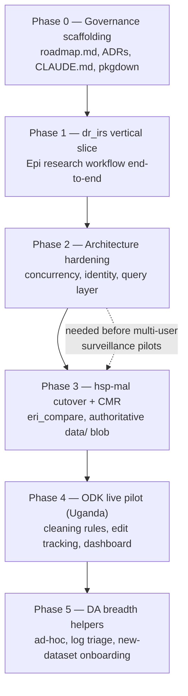

# erifunctions V2 — Development Phases Roadmap

> **Status:** living document. This is the shared, version-controlled north star for V2.
> Update it as phases land or decisions change, and record any architectural decision as an
> ADR under [`docs/adr/`](adr/). See [`CLAUDE.md`](../CLAUDE.md) for the working conventions
> that keep development aligned with this roadmap, and [`vision.md`](vision.md) for the
> founding brief this plan derives from.

## Context

`erifunctions` is the Carter Center ERI team's R package: the API through which Data
Analysts (DAs) and Epidemiologists (Epis) interact with TCC's Azure-centred data system
across countries (Haiti, DR, Uganda, OEPA) and diseases. V1 was built fast and organically
through **seven phases (v0.2.0 → v0.8.0)** and already ships most of the founding vision: the
3-layer data model + approval gate (`R/dal.R`), DQ engine (`R/dq.R`), CMR/surveillance
ingest, ODK lifecycle, data catalog, research scaffolding (`R/research.R`),
spatial/epi/reporting, SharePoint/Teams, and onboarding.

So **V2 is not a greenfield refactor.** It is: (1) resolve the architecture decisions V1
deferred, (2) harden V1 for real non-developer users, (3) fill the functional gaps the
vision implies, and (4) keep design intent under version control so it survives across
sessions and teammates.

**All three pilots — `dr_irs`, CMR/surveillance, and ODK — are first-class V2 work.**
`dr_irs` leads simply because its data is already available; the real CMR and ODK uploads
are ~a week out. Critically, the CMR/surveillance and ODK phases are **not blocked on those
uploads**: they can be developed against the data already in Azure (`staged/`, `raw/`) as a
**simulation harness**, with real-data validation following when the uploads land. Caveat:
much of the staged Excel is *already clean*, so to exercise the DQ and cleaning-rule paths
the harness must **synthesize realistic anomalies** into a copy of that clean data rather
than assume dirty input.

The ordering puts the chosen first pilot (`dr_irs`, single-analyst, low-stakes, exercises
the most novel research machinery) ahead of the multi-user surveillance pilots, and inserts
architecture hardening (concurrency/identity) *before* concurrent surveillance approval
becomes load-bearing.

---

## Architecture decisions

Each decision below is captured as a standalone ADR. They are the substance of the founding
brief's "Some Questions" section (see [`vision.md`](vision.md)).

| ADR | Decision | Resolves |
|-----|----------|----------|
| [0001](adr/0001-single-package-with-pkgdown.md) | Stay a single package; solve discoverability with pkgdown grouped reference + role vignettes | "Split into eriauth/eriresearch/…?" |
| [0002](adr/0002-concurrency-safe-metadata.md) | Make catalog/registry writes concurrency-safe (ETag/optimistic) and rebuildable | "Do we need a formal database?" |
| [0003](adr/0003-token-derived-identity.md) | Derive approver identity from the auth token, not a self-declared env var | Approval-gate integrity |
| [0004](adr/0004-duckdb-query-layer.md) | Keep blob as system-of-record; add a serverless DuckDB query layer | "Better use of Azure storage?" |
| [0005](adr/0005-pull-then-process.md) | Confirm pull-then-process; provenance via the pull entry points | "Pull-then-process vs push?" |
| [0006](adr/0006-research-projects-as-repos.md) | Research projects are separate repos generated from a template, depending on erifunctions | "How to organise Epi analysis code?" |
| [0007](adr/0007-research-aware-spatial-sourcing.md) | Research-aware spatial sourcing: a `cache` flag on `eri_spatial_load()` delegating to `eri_research_pull()` | Reproducible spatial inputs (Phase 1) |
| [0008](adr/0008-baked-azure-auth-defaults.md) | Bake non-secret auth constants into the package; default to interactive AAD auth | Zero-config login (Phase 2 precondition, brought forward) |
| [0009](adr/0009-research-data-lifecycle.md) | Azure is the source, the research project the versioned working copy; pulls archive + dedup, canonical writes gated | Reproducible research inputs (Phase 1) |
| [0010](adr/0010-odk-repeat-group-tables.md) | ODK repeat groups land as a relational set of tables (one Parquet per export table), approved together | ODK repeat-form fidelity (Phase 4) |
| [0012](adr/0012-source-measure-data-model.md) | Address data by 5 axes splitting data_source (channel) from data_type (measure); general ingest core + legacy adapters | Coherent data-addressing model (#175); supersedes ADR-0011 |
| [0013](adr/0013-odk-submission-backfill.md) | Write records *into* ODK Central (submission backfill): deterministic instanceID idempotency, columns map by field name, repeats reuse ADR-0010 | `eri_odk_upload()` (Phase 4, #211) |
| [0014](adr/0014-feedback-ticket-log.md) | In-package feedback / ticket log in the `data/` blob (capture now via `eri_feedback()`, reusing ADR-0002/0003); triage is a later feature | Tight adoption feedback loop (#237) |

---

## Phase 0 — Governance & shared memory scaffolding  *(landed)*

Moves design intent out of the gitignored `sandbox/` and into the repo so teammates and
fresh sessions inherit it.

- **`docs/roadmap.md`** — this document.
- **`docs/adr/`** — the six ADRs above plus a README explaining the format.
- **`CLAUDE.md`** (repo root) — concise project memory: purpose, the 3-layer model +
  approval gate, naming conventions, where ADRs/roadmap live, the "global vs local solution"
  guardrail, and the pre-PR check routine.
- **`_pkgdown.yml`** — grouped function reference (ADR-0001) + articles from existing vignettes.
- **`.github/workflows/pkgdown.yaml`** — build/deploy the documentation site.
- README version banner fix + roadmap link.

**Verification:** `R CMD check` clean; `pkgdown::build_site()` renders with the grouped
reference; ADRs and roadmap render; links resolve. (Built in CI — this repo's dev container
has no local R.)

---

## Phase 1 — `dr_irs` vertical slice (Epi research, end-to-end)  *(first pilot)*

Drive the real DR IRS interrupted-time-series study end-to-end with the package. **The
package's role here is to *source data reproducibly* and *maintain study-data discipline* —
not to do the analysis.** Epidemiologists run the ITS themselves (matching, windowing,
modelling, counterfactuals) in the research repo (ADR-0006); the package removes the friction
around getting data in, keeping it reproducible, and producing standard figures. The
scaffolding already fits — `eri_research_init("dr_irs_2024", "dr", "malaria", …)` is the
documented example.

**Required input:** `dr_irs.R` and the structure of its IRS / incidence / spatial inputs
(local, gitignored).

1. **Source the data with provenance.** IRS is not routinely reported, so digitized IRS data
   enters via `eri_artifact_upload()` → `eri_artifact_pull()`; malaria incidence comes from
   the surveillance `processed/` layer via `eri_research_pull()`; spatial (admin boundaries,
   LandScan) is sourced from the Azure `spatial/` blob via `eri_spatial_load()` /
   `eri_spatial_pop()`. **Gap:** spatial reads from Azure without caching — cache every input
   into the project and record it in `research.yaml` for reproducibility. Exercise the
   surveillance pipeline (`eri_ingest` → `eri_stage` → `eri_approve`) by updating incidence
   with a newer country dataset, then re-pulling.
2. **Reconcile inputs for sourcing** (not analysis): a thin, opt-in geocoding/admin-unit
   reconciliation helper mapping free-text localities to canonical admin units
   (`eri_spatial_join`). The ITS matching/windowing/modelling stays in the research repo.
3. **Version-tag-linked-to-publication** (genuine gap): `eri_research_snapshot()` freezes
   `data/` but gives no named tag binding *data + code commit + outputs* to a publication.
   Add `eri_research_tag(label, …)` recording snapshot ref + analysis git SHA + output
   manifest, so an analysis is reproducible from a citation — including across data updates.
4. **Research-repo template** (ADR-0006): port `dr_irs` into a standalone repo from the new
   template as the reference example (this is where the ITS analysis lives).
5. **(Stretch) figures:** thin helpers on top of `eri_map_*` / `eri_brand_ggplot_theme()` for
   the recurring study figures.
6. **Epidemiologist documentation** *(done)*: a role-oriented, copy-paste **worked example** of the
   full research lifecycle on safe public data (`vignettes/epi-research-guide.Rmd`, using
   `mtcars`), superseding the older `research-workflow` vignette. This also seeds the **task-guide
   framework** (one guide per user role × task), tracked in [`guides.md`](guides.md) — the live
   index of which guides exist and which are still missing.

**Verification:** a `test-smoke.R`-style live test (`ERI_SMOKE_TESTS=true`): init → pull IRS
artifact + incidence + spatial (cached, with provenance) → [analysis runs in the example
research repo] → upload outputs → `eri_research_tag()`; update incidence through the pipeline
and re-tag; re-pull the original tag on a clean checkout and reproduce its figure.

---

## Phase 2 — Architecture hardening

Implements ADR-0002/0003/0004 before multi-user surveillance pilots make concurrency and
identity load-bearing.

> **Update (2026-06-16):** the *interactive-auth enablement* half of ADR-0003 landed early —
> zero-config browser auth via baked non-secret defaults ([ADR-0008](adr/0008-baked-azure-auth-defaults.md)) —
> because epidemiologists couldn't use the package without it. Token-derived approver identity
> (`.eri_token_identity()`, below) remains the Phase 2 work.
- ~~Concurrency-safe + rebuildable catalog/registries (`R/catalog.R`, `R/odk_registry.R`,
  `R/artifacts.R`); add `eri_catalog_rebuild()`.~~ **Shipped** — catalog/registry/artifact writes go
  through `.eri_yaml_update()` (read-with-ETag, conditional `If-Match`/`If-None-Match` write, re-read +
  retry on 412); `eri_catalog_rebuild()` reconstructs the catalog from the processed-layer parquet
  listing (ADR-0002). **Closes Phase 2.**
- ~~`.eri_token_identity()`; `eri_approve()` uses verified identity.~~ **Shipped** — governed actions
  (approve `approved_by`, catalog `registered_by`, op-logs) record the verified Azure AD token identity;
  `ERI_ANALYST_ID` is the service-principal fallback (ADR-0003).
- ~~`eri_query()` DuckDB-over-parquet read layer.~~ **Shipped** — catalog-driven roll-ups + explicit-table
  joins over processed parquet via an in-process DuckDB session (`duckdb`/`DBI` as Suggests). Brought
  forward to close the DA ad-hoc-request task ahead of the rest of Phase 2 (concurrency-safe metadata
  and token identity), which has since shipped.

**Verification:** concurrent-writer unit test shows no lost updates; a spoofed
`ERI_ANALYST_ID` no longer changes `approved_by`; `eri_query()` SQL across two processed
datasets returns a correct join.

---

## Phase 3 — hsp-mal cutover tooling + CMR/surveillance pilot

Make the `data/` blob authoritative and retire the contractor pipeline on evidence. Built
against existing Azure data as a simulation; validated against real uploads when they land.
- **Simulation harness**: pull existing `staged/`/`raw/` files to stand in for "new data."
  Because that data is largely already clean, add an anomaly-injection helper so the DQ and
  cleaning paths are genuinely exercised.
- **`eri_compare()`**: diff `eri_ingest()`'s `data/staged` output against the
  `projects/intermediate` (hsp-mal) output the dual-write already produces — row/column/value
  reconciliation. No such tool exists today.
- Define written **cutover criteria** (N consecutive periods of equivalence) as an ADR.
- Harden `eri_ingest_cmr()` / `eri_stage()`; fold DQ failures into the log-triage surface
  (Phase 5).
- **Retire the legacy adapters** that [ADR-0012](adr/0012-source-measure-data-model.md) isolates from
  the general ingest core: the `projects`-blob dual-write (now the opt-in `mirror_pipeline` parameter),
  `.eri_pipeline_registry`, `.eri_schema_country_map`, and the `rblf` combined code all come out at the
  cutover, leaving `eri_ingest()` purely general over the 5-axis model.

**Verification:** simulation run ingests an Azure-sourced (anomaly-injected) file both ways;
`eri_compare()` reports parity or precise deltas; approval promotes with token identity;
catalog updated atomically. Re-run against the real June CMR + malaria files once uploaded.

---

## Phase 4 — ODK live pilot (Uganda survey)

Developed against existing synced ODK submissions (simulation); validated against the live
Uganda form once it launches. Exercises register/sync/status and fills two named gaps.
Forms with **repeat groups** now sync as a relational set of tables in `raw/`
([ADR-0010](adr/0010-odk-repeat-group-tables.md)), which the cleaning-rules layer, edit
tracking, and dashboard below all build on:
- **Live cleaning-rules layer**: versioned, declarative cleaning applied *on read* for
  dashboards while `raw/` stays pristine — distinct from the slow `approve` gate. New
  `cleaning_rules` concept layered on the DQ schema engine (`R/dq.R`).
- **Manual-edit tracking**: capture ODK Central submission edit history during
  `eri_odk_sync()` so direct edits are auditable.
- **Submission backfill** (`eri_odk_upload()`) — the inverse of `download_odk_form()` /
  `eri_odk_sync()`: bulk-create submissions on an existing **published** form from a CSV/Excel table,
  for migrating paper or legacy records into ODK Central. Maps columns → form fields via the form's
  `/fields` schema,
  builds one instance XML per row, and POSTs each to `.../forms/{id}/submissions` with a
  **deterministic `instanceID`** so re-runs are idempotent (HTTP 409 = already loaded → skip).
  A `dry_run`/validation pass (required-field, choice-list, and type/format checks — dates and
  geopoints especially) runs before anything is sent, and the call returns a per-row outcome
  tibble (`created` / `skipped` / `failed`) rather than aborting the batch on one bad row. Flat
  forms first; **repeat groups** reuse the ADR-0010 relational-table convention (parent + child
  CSVs joined on `PARENT_KEY`) as a fast-follow. Attachments are out of scope — the REST
  submission endpoint excludes them. Independent of the live-pilot timing.
- Quarto **survey dashboard** template (replacing PowerBI) built on `R/reports_html.R`.

**Verification:** sync the form; introduce a manual edit and confirm capture; a cleaning rule
changes the dashboard view but not `raw/`; dashboard renders the indicator set (counts, age
range, map, positives, open-text, DQ flags).

---

## Phase 5 — DA breadth helpers

The remaining DA tasks, once the spine is solid.
- **Ad-hoc request** helpers on top of `eri_query()` (lookups/figures for presentations).
- **Error/log triage** surface: the structured op-logs already written to Azure `…/logs/`
  need a reader — `eri_logs()` to list/filter/triage a backlog and mark items handled.
- **New-dataset onboarding** generalised (IRS as the worked example) so adding a
  country/disease/data-type doesn't require core edits — extends `R/onboarding.R`.

**Verification:** `eri_logs()` surfaces a seeded error backlog; an ad-hoc cross-country query
returns expected numbers; onboarding a new data type round-trips ingest→approve→catalog.

---

## Inputs needed from the team (before the relevant phase)
- **Phase 1:** `dr_irs.R` and example IRS + incidence data shapes.
- **Phase 2:** confirmation of the Azure AD app registration / RBAC so all DAs/Epis can use
  interactive browser auth (ADR-0003 assumes token identity is available to every user).
- **Phases 3–4:** not blocked on the real uploads — built against existing Azure
  `staged/raw` + synced ODK data as a simulation, then re-validated when the real CMR/ODK
  uploads arrive. Phase 4 also needs ODK Central audit-log/permissions for edit tracking.
